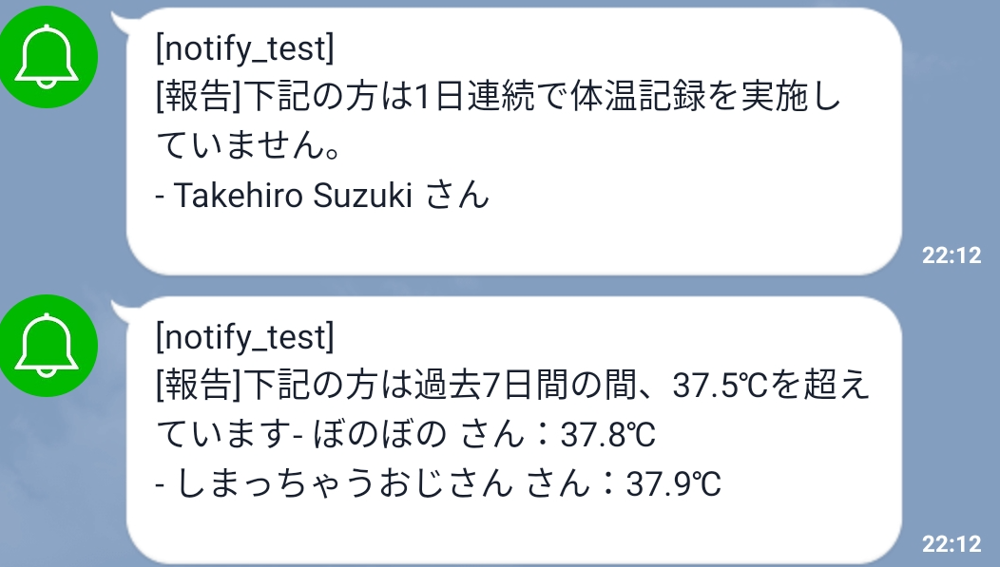

layout: page
title: "運営向け"
permalink: /for_executives/

# SCO体温管理 運営向け資料
## 運営向け機能
* ３日（？）連続して体温を記録していないユーザーの通知
* 過去７日（？）の間に37.5℃を超えたユーザーの通知

※画像は「1日連続」「過去７日」となっているが変更可能
* [全メンバー体温推移確認](https://sco-covid19.tk/dashboard/1)
  * メールアドレス・パスワード：SCO googleアカウントに同じ
  * ※個人情報につき取り扱い注意