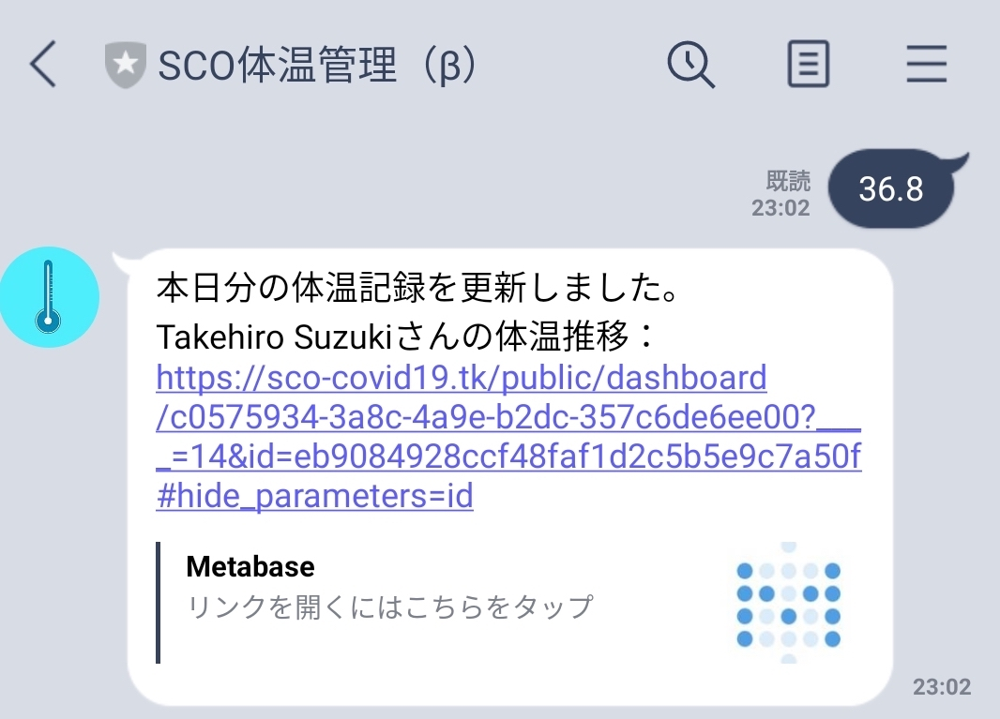
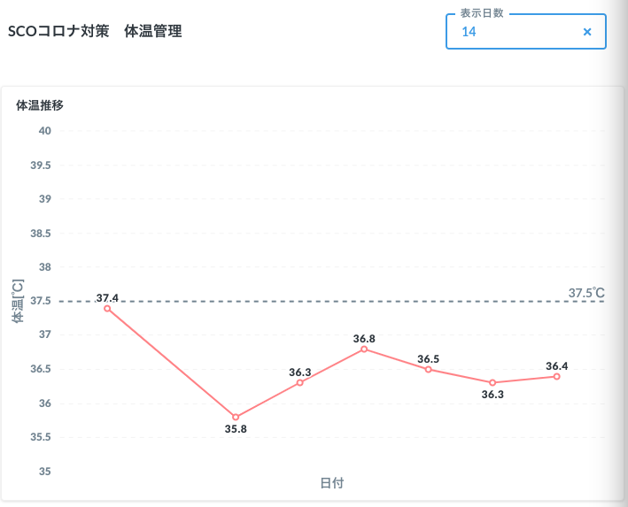

# SCO コロナウイルス対策について
## はじめに
SCOではコロナウイルスから団員の皆さんを守るため、参加される方に日々の体温測定をお願いしております。**練習日７日前から練習当日までに、体温が37.5℃を超える日がある場合は、参加をご遠慮頂いております。**  
ご面倒をおかけすることになりますが、なるべく皆さんの負担を軽減すべく、lineでbotに体温を送信するのみの作業と致しました。  
何卒、ご理解・ご協力のほど、お願いいたします。

## つかいかた
1. [体温管理bot](https://lin.ee/UXFCFQ4)を友だちに追加  

2. 体温をメッセージに入力して送信（毎日？）

※SCO体温管理botから送られてくるURLをタップすることで、日々の体温推移が確認できます。  
※ダッシュボードは6:00-24:00の間のみアクセス可能です（深夜アクセス不可）。  
※URLは各個人ごとに発行されます。

## 備考

* 記録を忘れた場合、botからリマインダーを送信させて頂きます。
* 記録なしの日が長く続く場合、運営メンバーよりご連絡させて頂くことがございます。
* システムの不具合等を発見された場合は[鈴木](https://line.me/ti/p/jFe1fscymC)もしくは運営メンバーまでご報告頂けますと幸いです。
